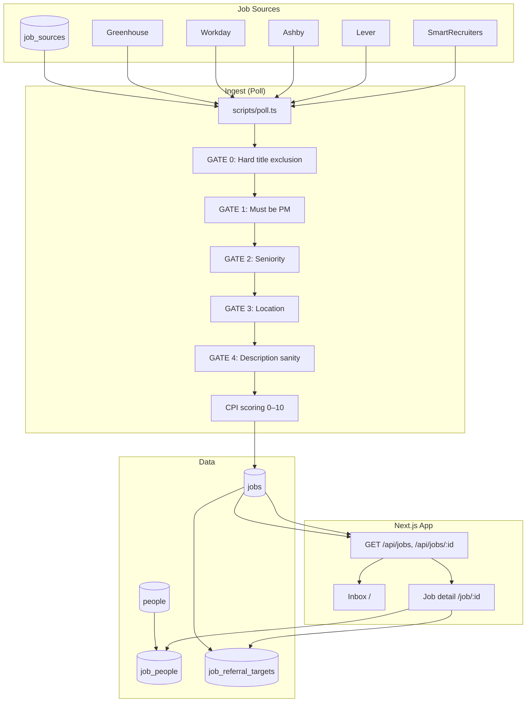

# RoleRadar — System Diagram & Requirements

## 1. System Diagram

**Flow in words:**

1. **Job sources** (`job_sources` table) — company, URL, parser (Greenhouse, Workday, Ashby, Lever, SmartRecruiters). Seed scripts add/update sources.
2. **Poll** (`npm run poll`) — fetches listings from each enabled source; for each job runs **GATE 0→4** (title exclusion, PM title, seniority, location, description sanity). Only if all pass → **CPI** computed (0–10) and job **stored** in `jobs`.
3. **CPI** — multi-layer: Role Fit Score (0–5) + AI Depth Score (0–5), clamped 0–10. Tier: 9–10 Top 5%, 7–8 Top 20%, &lt;7 Reject.
4. **Inbox** — reads `jobs` via GET /api/jobs; shows only jobs **added in the last 24 hours** (`created_at >= now - 24h`), **deduped** by (company, normalized title); grouped by tier (Top 5%, Top 20%, Reject).
5. **Job detail** — for CPI ≥ 7: **referral targets** (up to 3: Recruiter, Hiring Manager, High-Signal Connector) from `job_referral_targets` (Google search URLs, why selected, status, copy message); optional **From your network** from `job_people` + `people`.
6. **Agent** (`npm run agent`) — runs poll only 5pm–1am local, every 30 min.

---

## 2. Requirements Summary

### Overview

- **Product:** RoleRadar — selective job aggregation and fit scoring for one user (Principal PM-T / GenAI) to discover and prioritize roles and generate referral-ready copy. **No auto-apply, no auto-send.**
- **User:** Single candidate (Srinitya), PM-T at Amazon Alexa AI, targeting Principal-level GenAI product roles.

### Goals

| Goal | Description |
|------|-------------|
| Selective targeting | Only roles that pass explicit gates (PM title, seniority, location, description sanity, CPI). |
| Principal GenAI focus | Optimize for Principal-level, GenAI-relevant product roles. |
| Referral-first | Connect note → referral ask; manual approval at every step. |
| Single source of truth | One inbox with jobs tiered: Top 5%, Top 20%, Reject. |

### Non-Goals (Out of Scope)

- No auto-apply
- No email scraping
- No auto-sending (DMs, connection requests, applications)
- LinkedIn only for outreach (copy only; user pastes/sends)
- No other outreach channels unless added later

---

### Functional Requirements

**FR-1 — Job sources and ingestion**

| ID | Requirement |
|----|-------------|
| FR-1.1 | One or more job sources (company + URL + parser). |
| FR-1.2 | At least one parser type (Greenhouse, Workday, Ashby, Lever, SmartRecruiters). |
| FR-1.3 | Fetch on demand (poll); new jobs in DB with title, location, URL, external_id, description. |
| FR-1.4 | Deduplicate per source by external_id. |
| FR-1.5 | (Optional) Agent runs poll only in time window (e.g. 5pm–1am), interval (e.g. 30 min). |

**FR-2 — Fit scoring (gates + CPI)**

| ID | Requirement |
|----|-------------|
| FR-2.1 | CPI (Candidate–Role Fit Index) 0–10 per job. |
| FR-2.2 | Gates: GATE 0 (title exclusion), GATE 1 (PM title), GATE 2 (seniority), GATE 3 (location), GATE 4 (description sanity). Only then CPI. |
| FR-2.3 | Tier: Top 5% (9–10), Top 20% (7–8), Reject (&lt;7). |
| FR-2.4 | Jobs with no scoreable description may have null CPI/tier; still stored and displayed. |

**FR-3 — Inbox and API**

| ID | Requirement |
|----|-------------|
| FR-3.1 | Inbox view: jobs grouped by tier (Top 5%, Top 20%, Reject); title, location, CPI, actions. |
| FR-3.2 | GET /api/jobs returns jobs grouped by tier (top5, top20, reject). |
| FR-3.3 | Within tier: order by CPI desc, then recency. |

**FR-4 — Referral workflow (copy only)**

| ID | Requirement |
|----|-------------|
| FR-4.1 | Connect note + referral ask (Job ID, placeholder/name); no auto-send. |
| FR-4.2 | One-tap copy to clipboard. |
| FR-4.3 | No sending on behalf of user. |
| FR-4.4 | Copy for display only; user decides whether to paste and send. |

**FR-5 — Configuration**

| ID | Requirement |
|----|-------------|
| FR-5.1 | Sources configurable (add/disable) via DB or seed. |
| FR-5.2 | Agent window and interval documented and reproducible. |

---

### Data Model (Logical)

| Table | Purpose |
|-------|---------|
| **job_sources** | id, company, url, parser, enabled |
| **jobs** | id, source_id, external_id, title, location, url, description, cpi, tier, created_at |
| **people** | id, name, title, company, linkedin_url, relationship_type, connection_status, notes |
| **job_people** | job_id, person_id, message_type, drafted_message, outreach_status (from people pool) |
| **job_referral_targets** | job_id, slot, target_type, search_url, why_selected, outreach_status, drafted_message (up to 3 per job, CPI ≥ 7) |

---

### Non-Functional Requirements

| ID | Requirement |
|----|-------------|
| NFR-1 | Run locally or in user-controlled environment. |
| NFR-2 | Poll and agent runnable via CLI (npm scripts). |
| NFR-3 | Inbox viewable in browser (localhost or deployed). |
| NFR-4 | No PII scraped beyond what user provides (e.g. name in templates). |

---

### Success Criteria

- User can add sources, run poll, and see jobs in Inbox tiered by CPI.
- User can copy connect note and referral ask and paste manually into LinkedIn.
- Optional: Agent runs only in configured window without manual poll.
- No automatic applications or messages are ever sent.
