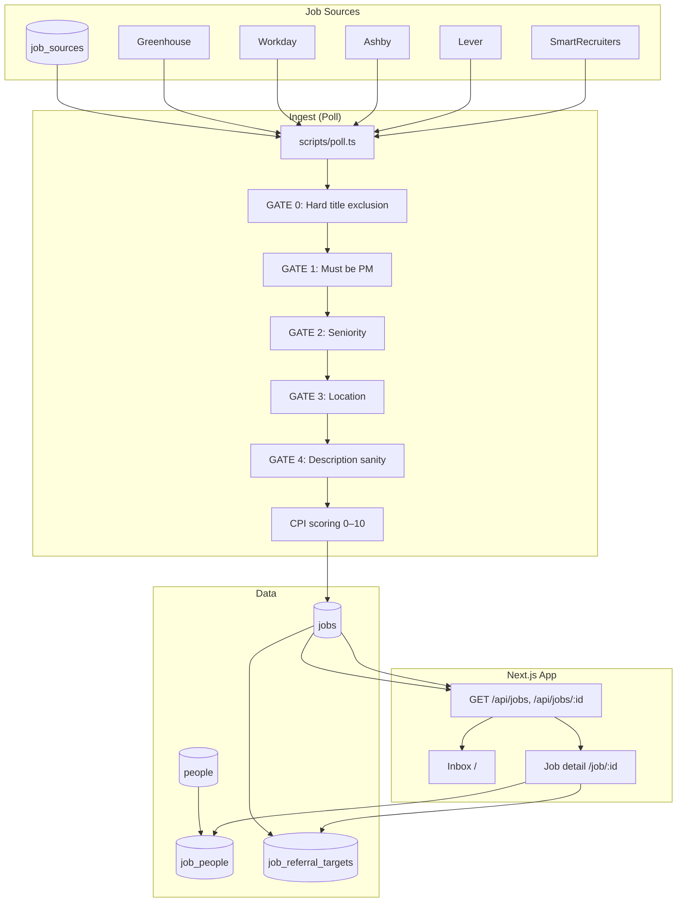

# RoleRadar — System Diagram & Requirements

## 1. System Diagram

**Flow in words:**

1. **Job sources** (`job_sources` table) — company, URL, parser. **Target strategy:** [JOB_SOURCE_FETCHING_V2_SPEC.md](JOB_SOURCE_FETCHING_V2_SPEC.md) (company tiers, polling frequency, Greenhouse/Ashby/Workday/Custom Enterprise, fetch-time pre-filtering, posted_date ≤ 21 days). Current poll is legacy.
2. **Poll** (`npm run poll`) — fetches listings from each enabled source; for each job runs **GATE 0→4** (title exclusion, PM title, seniority, location, description sanity). Only if all pass → **final_fit_score** (0–100) and **resume_match** (0–100) computed; **bucket** (APPLY_NOW / STRONG_FIT / NEAR_MATCH / REVIEW / HIDE) stored on job. NEAR_MATCH jobs get **suggestions_json** (tailored resume emphasis).
3. **Scoring** — Role Relevance (0–40) + AI Depth (0–30) + Domain Fit (0–20) − Penalties (0–30) → final_fit_score 0–100. Bucket from resume_match + final_fit_score. See [INBOX_AND_AGENT_SPEC.md](INBOX_AND_AGENT_SPEC.md).
4. **Inbox** — reads `jobs` via GET /api/jobs/list; jobs where (posted_at OR first_seen_at) in last **recency_days** (default 21), deduped by (company, normalized title). Sections: Apply now, Strong fit, Near match, Review, Hidden. Location: CA + Seattle; remote-only excluded unless allow_remote.
5. **Job detail** — **referral targets** (4 slots: Recruiter, Hiring Manager, Team PM/Peer, High-Signal Connector) from `job_referral_targets`. **connection_status** (n/a, not_found, found, stale); **Refresh targets** when stale/not_found. **Suggestions** for NEAR_MATCH. See [CONNECTIONS_LOGIC_V2_SPEC.md](CONNECTIONS_LOGIC_V2_SPEC.md).
6. **Agent** (`npm run agent`) — wake interval (default 30 min); per-source poll is tier-based (30 min / 2 hr / daily). Prewarm for APPLY_NOW, STRONG_FIT, top NEAR_MATCH (resume_match ≥ 88). Config: [INBOX_AND_AGENT_SPEC.md](INBOX_AND_AGENT_SPEC.md).

---

## 2. Requirements Summary

### Overview

- **Product:** RoleRadar — selective job aggregation and fit scoring for one user (Principal PM-T / GenAI) to discover and prioritize roles and generate referral-ready copy. **No auto-apply, no auto-send.**
- **User:** Single candidate (Srinitya), PM-T at Amazon Alexa AI, targeting Principal-level GenAI product roles.

### Goals

| Goal | Description |
|------|-------------|
| Selective targeting | Only roles that pass explicit gates (PM title, seniority, location, description sanity, CPI). |
| Principal GenAI focus | Optimize for Principal-level, GenAI-relevant product roles. |
| Referral-first | Connect note → referral ask; manual approval at every step. |
| Single source of truth | One inbox with jobs bucketed: Apply now, Strong fit, Near match, Review, Hidden. |

### Non-Goals (Out of Scope)

- No auto-apply
- No email scraping
- No auto-sending (DMs, connection requests, applications)
- LinkedIn only for outreach (copy only; user pastes/sends)
- No other outreach channels unless added later

---

### Functional Requirements

**FR-1 — Job sources and ingestion**

| ID | Requirement |
|----|-------------|
| FR-1.1 | One or more job sources (company + URL + parser). |
| FR-1.2 | At least one parser type (Greenhouse, Workday, Ashby, Lever, SmartRecruiters). |
| FR-1.3 | Fetch on demand (poll); new jobs in DB with title, location, URL, external_id, description. |
| FR-1.4 | Deduplicate per source by external_id. |
| FR-1.5 | (Optional) Agent runs poll on interval (default 30 min, 24/7); optional time window. See [AGENT.md](AGENT.md). |

**FR-2 — Fit scoring (gates + scoring + buckets)**

| ID | Requirement |
|----|-------------|
| FR-2.1 | Gates: GATE 0 (title exclusion), GATE 1 (PM title), GATE 2 (seniority), GATE 3 (location), GATE 4 (description sanity). Only then score. |
| FR-2.2 | final_fit_score 0–100 (Role + AI + Domain − Penalty); resume_match 0–100 from profile. |
| FR-2.3 | Bucket: APPLY_NOW, STRONG_FIT, NEAR_MATCH, REVIEW, HIDE (stored on job). |
| FR-2.4 | NEAR_MATCH jobs get tailored suggestions (suggestions_json). |

**FR-3 — Inbox and API**

| ID | Requirement |
|----|-------------|
| FR-3.1 | Inbox view: jobs grouped by bucket (Apply now, Strong fit, Near match, Review, Hidden); title, location, bucket, actions; Refresh targets when connection_status stale/not_found. |
| FR-3.2 | GET /api/jobs/list returns jobs grouped by bucket (top5=apply_now, top20=strong_fit, etc.). |
| FR-3.3 | Recency: (posted_at OR first_seen_at) in last recency_days (default 21). |

**FR-4 — Referral workflow (copy only)**

| ID | Requirement |
|----|-------------|
| FR-4.1 | Up to 4 referral targets per job: Recruiter, Hiring Manager, Team PM/Peer, High-Signal Connector (Google search URLs, why selected, copy message). |
| FR-4.2 | Connect note + referral ask (Job ID, placeholder/name); no auto-send. One-tap copy to clipboard. |
| FR-4.3 | No sending on behalf of user. Refresh targets when connection_status stale/not_found (GET /api/jobs/:id?refresh_targets=1). |
| FR-4.4 | Copy for display only; user decides whether to paste and send. |

**FR-5 — Configuration**

| ID | Requirement |
|----|-------------|
| FR-5.1 | Sources configurable (add/disable) via DB or seed. |
| FR-5.2 | Agent interval and window (default 24/7) documented; see [AGENT.md](AGENT.md) and REQUIREMENTS.md § Running the agent. |

---

### Data Model (Logical)

| Table | Purpose |
|-------|---------|
| **job_sources** | id, company, url, parser, enabled |
| **jobs** | id, source_id, external_id, title, location, url, description, cpi, tier, created_at |
| **people** | id, name, title, company, linkedin_url, relationship_type, connection_status, notes |
| **job_people** | job_id, person_id, message_type, drafted_message, outreach_status (from people pool) |
| **job_referral_targets** | job_id, slot, target_type, search_url, why_selected, outreach_status, drafted_message (up to 4 per job; needConnections by bucket) |

---

### Non-Functional Requirements

| ID | Requirement |
|----|-------------|
| NFR-1 | Run locally or in user-controlled environment. |
| NFR-2 | Poll and agent runnable via CLI (npm scripts). |
| NFR-3 | Inbox viewable in browser (localhost or deployed). |
| NFR-4 | No PII scraped beyond what user provides (e.g. name in templates). |

---

### Success Criteria

- User can add sources, run poll, and see jobs in Inbox tiered by CPI.
- User can copy connect note and referral ask and paste manually into LinkedIn.
- Optional: Agent runs on schedule (default 24/7, every 30 min) without manual poll.
- No automatic applications or messages are ever sent.
